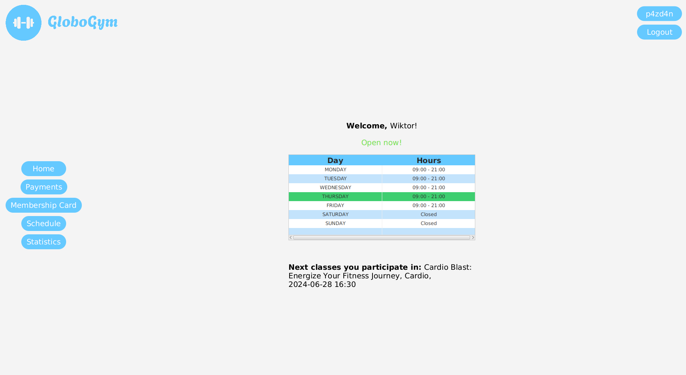
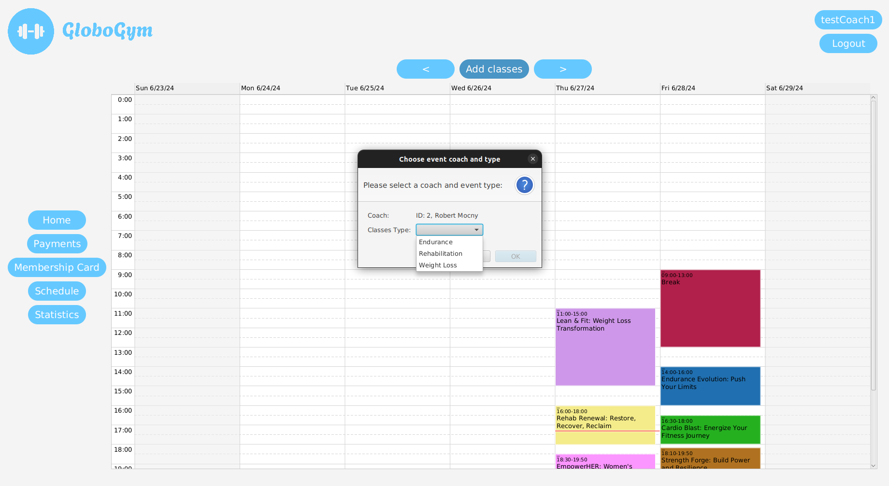
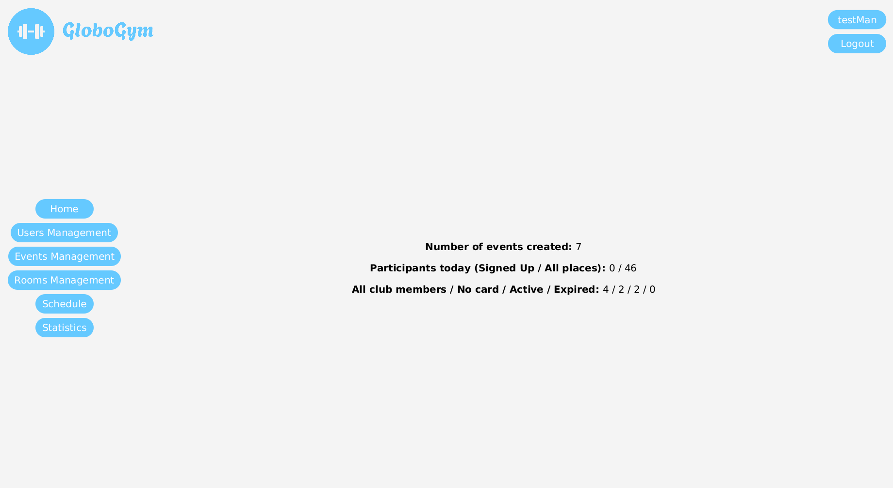
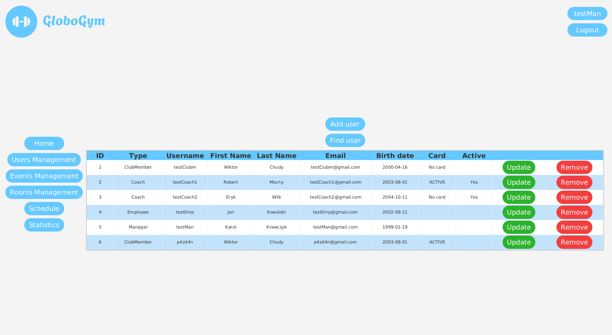

# 💻 GloboGym

## 👀 About

App for fictional gym "Globo Gym" created with JavaFX. It consists of over 50 classes and is robust system, which deliver a lot of functionalities to both users and employees. I spent many hours researching and designing all business cases to make the application as reliable as possible. Each feature has been developed with the greatest attention to detail to increase user comfort and reduce the susceptibility to errors. I also created responsive and intuitive UI, which makes app easy to navigate and use.

## 🔧 Tech Stack

- Java (OOP, Streams, Lambdas, Serialization)
- JavaFX
- Maven
- CSS
- Git

## 💡 Features

- App uses serialization mechanisms, so all changes, which you made are saved to file and are visible when you restart the app.
- Validation for all forms in app.
- Registration - you can register club member or coach account. Coach account requires approval by an employee.
- Authentication - you can login to your accoun after registration.
- All users have possibility to see opening hours of gym at approriate days and check whether gym is open now.
- All users have possibility to see their profile, change profile picture and update data.
- All users have possibility to see schedule (as calendar) with highlighted classes and other events on appropriate days and times.
- All users have possibility to see some statistics related to their account.
- Club members and coaches have possibility to deposit money and increase their balance. Their can also see payments history.
- Club members and coaches have possibility to buy membership card, renew membership and to see appearance of their card.
- Club members and coaches can sign up for classes if they are not already signed up, have active membership, classes are taking place in the future from now and there are still places available.
- Employees and managers can add classes to schedule.
- Coaches can also add classes to schedule, if their membership is active.
- Employees and managers can add other events to schedule.
- Administration panels for employees and managers.

## 💳 Example login data

1. **Manager**
Login: testMan
Password: !Test123
2. **Employee**
Login: testEmp
Password: !Test123
3. **Coach 1**
Login: testCoach1
Password: !Test123
4. **Coach 2**
Login: testCoach2
Password: !Test123
4. **Club member**
Login: testClubm
Password: !Test123

## 📺 Demo

